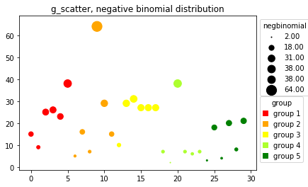

--- 
title: 'Creating scatter plots with pandas, matplotlib, and seaborn'
---

I wanted an easy way to plot scatter plots with marker size and marker color and the legend on the plot. I couldn't figure out how to install ggplot for Python so I wrote my own scatter plot. (I eventually figured out how to install it but after I already wrote this.)


```python
# importing packages
import pandas as pd
import numpy as np
import matplotlib.pyplot as plt
import seaborn as sns
# from ggplot import *    # requires a pip install
%matplotlib inline
```


```python
import sys
!{sys.executable} -m pip install ggplot
```

    Collecting ggplot
      Downloading ggplot-0.11.5-py2.py3-none-any.whl (2.2MB)
        100% |████████████████████████████████| 2.2MB 628kB/s eta 0:00:01
    [?25hRequirement already satisfied (use --upgrade to upgrade): pandas in ./anaconda/lib/python3.5/site-packages (from ggplot)
    Requirement already satisfied (use --upgrade to upgrade): numpy in ./anaconda/lib/python3.5/site-packages (from ggplot)
    Requirement already satisfied (use --upgrade to upgrade): statsmodels in ./anaconda/lib/python3.5/site-packages (from ggplot)
    Requirement already satisfied (use --upgrade to upgrade): matplotlib in ./anaconda/lib/python3.5/site-packages (from ggplot)
    Requirement already satisfied (use --upgrade to upgrade): six in ./anaconda/lib/python3.5/site-packages (from ggplot)
    Requirement already satisfied (use --upgrade to upgrade): scipy in ./anaconda/lib/python3.5/site-packages (from ggplot)
    Collecting brewer2mpl (from ggplot)
      Downloading brewer2mpl-1.4.1-py2.py3-none-any.whl
    Requirement already satisfied (use --upgrade to upgrade): patsy>=0.4 in ./anaconda/lib/python3.5/site-packages (from ggplot)
    Requirement already satisfied (use --upgrade to upgrade): cycler in ./anaconda/lib/python3.5/site-packages (from ggplot)
    Requirement already satisfied (use --upgrade to upgrade): python-dateutil>=2 in ./anaconda/lib/python3.5/site-packages (from pandas->ggplot)
    Requirement already satisfied (use --upgrade to upgrade): pytz>=2011k in ./anaconda/lib/python3.5/site-packages (from pandas->ggplot)
    Requirement already satisfied (use --upgrade to upgrade): pyparsing!=2.0.4,!=2.1.2,!=2.1.6,>=1.5.6 in ./anaconda/lib/python3.5/site-packages (from matplotlib->ggplot)
    Installing collected packages: brewer2mpl, ggplot
    Successfully installed brewer2mpl-1.4.1 ggplot-0.11.5
    You are using pip version 8.1.1, however version 9.0.1 is available.
    You should consider upgrading via the 'pip install --upgrade pip' command.


```python
from ggplot import *
```

    /Users/lacar/anaconda/lib/python3.5/site-packages/ggplot/utils.py:81: FutureWarning: pandas.tslib is deprecated and will be removed in a future version.
    You can access Timestamp as pandas.Timestamp
      pd.tslib.Timestamp,
    /Users/lacar/anaconda/lib/python3.5/site-packages/ggplot/stats/smoothers.py:4: FutureWarning: The pandas.lib module is deprecated and will be removed in a future version. These are private functions and can be accessed from pandas._libs.lib instead
      from pandas.lib import Timestamp
    /Users/lacar/anaconda/lib/python3.5/site-packages/statsmodels/compat/pandas.py:56: FutureWarning: The pandas.core.datetools module is deprecated and will be removed in a future version. Please use the pandas.tseries module instead.
      from pandas.core import datetools


### Use a complex sample data frame for a variety of test cases

This is necessary to test the robustness of the visualization properties of the function. In addition to the variety of distributions, zeros, negatives, fractions, and a large range of numbers are represented.


```python
# Alter the number of samples (training examples).
# Use a small m (20) to verify plotting properties and large m (1000) as a test case

m = 30
```


```python
np.arange(0, m)
```


    array([ 0,  1,  2,  3,  4,  5,  6,  7,  8,  9, 10, 11, 12, 13, 14, 15, 16,
           17, 18, 19, 20, 21, 22, 23, 24, 25, 26, 27, 28, 29])


```python
uniform_dist = np.arange(0, m)
gaussian_dist = np.random.normal(loc=0, scale=100, size=m)
bimodal_dist = (np.random.normal(loc=200, scale=100, size=int(m/2)).tolist()
                + np.random.normal(loc=800, scale=100, size=int(m/2)).tolist()) # I just mashed two normal distributions together
lognormal_dist = np.random.lognormal(5, 1, m)
poisson_dist = np.random.poisson(lam=0.3, size=m)
negbinomial_dist = np.random.negative_binomial(2, 0.1, size=m)
chisquare_dist = np.random.chisquare(df=4, size=m)
large_range = np.arange(0, m)**2       # Range of numbers across 6 log orders)
leftskew_dist = 100-np.random.negative_binomial(2, 0.1, size=m)

# Create dataframe with regression features
df = pd.DataFrame({'uniform': uniform_dist,
                  'gaussian': gaussian_dist,
                  'bimodal': bimodal_dist,
                  'lognormal': lognormal_dist,
                  'poisson': poisson_dist,
                   'negbinomial': negbinomial_dist,
                   'chisquare': chisquare_dist,
                   'large_range': large_range,
                   'leftskew_dist': leftskew_dist
                  })

# Create classification features and add to dataframe

k = 5     # number of groups
groupSize = round(m/k)
df['class_even'] = (['group 1']*groupSize + ['group 2']*groupSize
                     + ['group 3']*groupSize + ['group 4']*groupSize
                     + ['group 5']*(m-groupSize*(k-1)))

#                      + ['group 5']*groupSize + ['group 6']*groupSize
#                      + ['group 7']*groupSize + ['group 8']*groupSize
#                      + ['group 9']*groupSize
#                      + ['group 10']*(m-groupSize*(k-1)))

df['class_poisson'] = ['group ' + str(i+1) for i in poisson_dist.tolist()]

```


```python
df
```


<div>
<style scoped>
    .dataframe tbody tr th:only-of-type {
        vertical-align: middle;
    }

    .dataframe tbody tr th {
        vertical-align: top;
    }

    .dataframe thead th {
        text-align: right;
    }
</style>
<table border="1" class="dataframe">
  <thead>
    <tr style="text-align: right;">
      <th></th>
      <th>bimodal</th>
      <th>chisquare</th>
      <th>gaussian</th>
      <th>large_range</th>
      <th>leftskew_dist</th>
      <th>lognormal</th>
      <th>negbinomial</th>
      <th>poisson</th>
      <th>uniform</th>
      <th>class_even</th>
      <th>class_poisson</th>
    </tr>
  </thead>
  <tbody>
    <tr>
      <th>0</th>
      <td>154.250607</td>
      <td>6.316693</td>
      <td>-78.915374</td>
      <td>0</td>
      <td>89</td>
      <td>76.664209</td>
      <td>15</td>
      <td>0</td>
      <td>0</td>
      <td>group 1</td>
      <td>group 1</td>
    </tr>
    <tr>
      <th>1</th>
      <td>201.845077</td>
      <td>3.965357</td>
      <td>-23.312473</td>
      <td>1</td>
      <td>65</td>
      <td>984.974379</td>
      <td>9</td>
      <td>0</td>
      <td>1</td>
      <td>group 1</td>
      <td>group 1</td>
    </tr>
    <tr>
      <th>2</th>
      <td>260.563106</td>
      <td>2.779451</td>
      <td>191.841673</td>
      <td>4</td>
      <td>84</td>
      <td>58.073001</td>
      <td>25</td>
      <td>0</td>
      <td>2</td>
      <td>group 1</td>
      <td>group 1</td>
    </tr>
    <tr>
      <th>3</th>
      <td>118.606620</td>
      <td>2.886615</td>
      <td>55.952445</td>
      <td>9</td>
      <td>84</td>
      <td>7.025429</td>
      <td>26</td>
      <td>1</td>
      <td>3</td>
      <td>group 1</td>
      <td>group 2</td>
    </tr>
    <tr>
      <th>4</th>
      <td>194.212954</td>
      <td>12.006341</td>
      <td>-116.373243</td>
      <td>16</td>
      <td>57</td>
      <td>338.770022</td>
      <td>23</td>
      <td>0</td>
      <td>4</td>
      <td>group 1</td>
      <td>group 1</td>
    </tr>
    <tr>
      <th>5</th>
      <td>134.970457</td>
      <td>4.984677</td>
      <td>66.169012</td>
      <td>25</td>
      <td>81</td>
      <td>30.928304</td>
      <td>38</td>
      <td>0</td>
      <td>5</td>
      <td>group 1</td>
      <td>group 1</td>
    </tr>
    <tr>
      <th>6</th>
      <td>312.395224</td>
      <td>3.714452</td>
      <td>149.826987</td>
      <td>36</td>
      <td>92</td>
      <td>216.290403</td>
      <td>5</td>
      <td>0</td>
      <td>6</td>
      <td>group 2</td>
      <td>group 1</td>
    </tr>
    <tr>
      <th>7</th>
      <td>187.471422</td>
      <td>3.240577</td>
      <td>-65.834795</td>
      <td>49</td>
      <td>81</td>
      <td>79.486020</td>
      <td>16</td>
      <td>0</td>
      <td>7</td>
      <td>group 2</td>
      <td>group 1</td>
    </tr>
    <tr>
      <th>8</th>
      <td>153.502224</td>
      <td>2.098391</td>
      <td>30.631864</td>
      <td>64</td>
      <td>99</td>
      <td>189.996401</td>
      <td>7</td>
      <td>0</td>
      <td>8</td>
      <td>group 2</td>
      <td>group 1</td>
    </tr>
    <tr>
      <th>9</th>
      <td>87.044965</td>
      <td>9.083710</td>
      <td>52.957192</td>
      <td>81</td>
      <td>50</td>
      <td>451.305621</td>
      <td>64</td>
      <td>1</td>
      <td>9</td>
      <td>group 2</td>
      <td>group 2</td>
    </tr>
    <tr>
      <th>10</th>
      <td>64.804407</td>
      <td>4.380548</td>
      <td>6.434178</td>
      <td>100</td>
      <td>79</td>
      <td>139.635630</td>
      <td>29</td>
      <td>0</td>
      <td>10</td>
      <td>group 2</td>
      <td>group 1</td>
    </tr>
    <tr>
      <th>11</th>
      <td>166.618028</td>
      <td>1.541803</td>
      <td>-72.032221</td>
      <td>121</td>
      <td>97</td>
      <td>87.627416</td>
      <td>15</td>
      <td>0</td>
      <td>11</td>
      <td>group 2</td>
      <td>group 1</td>
    </tr>
    <tr>
      <th>12</th>
      <td>226.584262</td>
      <td>1.681881</td>
      <td>-8.462267</td>
      <td>144</td>
      <td>73</td>
      <td>207.464548</td>
      <td>10</td>
      <td>0</td>
      <td>12</td>
      <td>group 3</td>
      <td>group 1</td>
    </tr>
    <tr>
      <th>13</th>
      <td>170.130962</td>
      <td>6.851729</td>
      <td>-109.947474</td>
      <td>169</td>
      <td>74</td>
      <td>21.009332</td>
      <td>29</td>
      <td>0</td>
      <td>13</td>
      <td>group 3</td>
      <td>group 1</td>
    </tr>
    <tr>
      <th>14</th>
      <td>427.765719</td>
      <td>1.291694</td>
      <td>-30.045810</td>
      <td>196</td>
      <td>91</td>
      <td>144.216283</td>
      <td>31</td>
      <td>1</td>
      <td>14</td>
      <td>group 3</td>
      <td>group 2</td>
    </tr>
    <tr>
      <th>15</th>
      <td>609.179291</td>
      <td>4.701100</td>
      <td>264.884984</td>
      <td>225</td>
      <td>81</td>
      <td>123.514419</td>
      <td>27</td>
      <td>0</td>
      <td>15</td>
      <td>group 3</td>
      <td>group 1</td>
    </tr>
    <tr>
      <th>16</th>
      <td>1014.697466</td>
      <td>1.561184</td>
      <td>165.026958</td>
      <td>256</td>
      <td>88</td>
      <td>222.169308</td>
      <td>27</td>
      <td>0</td>
      <td>16</td>
      <td>group 3</td>
      <td>group 1</td>
    </tr>
    <tr>
      <th>17</th>
      <td>620.015938</td>
      <td>10.390554</td>
      <td>30.451860</td>
      <td>289</td>
      <td>91</td>
      <td>135.555152</td>
      <td>27</td>
      <td>0</td>
      <td>17</td>
      <td>group 3</td>
      <td>group 1</td>
    </tr>
    <tr>
      <th>18</th>
      <td>754.022337</td>
      <td>0.849390</td>
      <td>-50.784537</td>
      <td>324</td>
      <td>90</td>
      <td>108.753474</td>
      <td>7</td>
      <td>1</td>
      <td>18</td>
      <td>group 4</td>
      <td>group 2</td>
    </tr>
    <tr>
      <th>19</th>
      <td>829.121167</td>
      <td>2.269775</td>
      <td>-6.464158</td>
      <td>361</td>
      <td>90</td>
      <td>158.682129</td>
      <td>2</td>
      <td>0</td>
      <td>19</td>
      <td>group 4</td>
      <td>group 1</td>
    </tr>
    <tr>
      <th>20</th>
      <td>696.595967</td>
      <td>3.065890</td>
      <td>-15.288733</td>
      <td>400</td>
      <td>90</td>
      <td>138.275194</td>
      <td>38</td>
      <td>0</td>
      <td>20</td>
      <td>group 4</td>
      <td>group 1</td>
    </tr>
    <tr>
      <th>21</th>
      <td>791.143876</td>
      <td>3.368891</td>
      <td>46.619527</td>
      <td>441</td>
      <td>90</td>
      <td>131.092830</td>
      <td>7</td>
      <td>0</td>
      <td>21</td>
      <td>group 4</td>
      <td>group 1</td>
    </tr>
    <tr>
      <th>22</th>
      <td>739.749286</td>
      <td>1.748566</td>
      <td>-99.439755</td>
      <td>484</td>
      <td>68</td>
      <td>214.722840</td>
      <td>6</td>
      <td>0</td>
      <td>22</td>
      <td>group 4</td>
      <td>group 1</td>
    </tr>
    <tr>
      <th>23</th>
      <td>790.535959</td>
      <td>5.275529</td>
      <td>27.182666</td>
      <td>529</td>
      <td>94</td>
      <td>126.677069</td>
      <td>7</td>
      <td>0</td>
      <td>23</td>
      <td>group 4</td>
      <td>group 1</td>
    </tr>
    <tr>
      <th>24</th>
      <td>753.894054</td>
      <td>1.668527</td>
      <td>43.067058</td>
      <td>576</td>
      <td>86</td>
      <td>193.468215</td>
      <td>3</td>
      <td>1</td>
      <td>24</td>
      <td>group 5</td>
      <td>group 2</td>
    </tr>
    <tr>
      <th>25</th>
      <td>970.366730</td>
      <td>4.847279</td>
      <td>-4.231740</td>
      <td>625</td>
      <td>95</td>
      <td>125.024272</td>
      <td>18</td>
      <td>1</td>
      <td>25</td>
      <td>group 5</td>
      <td>group 2</td>
    </tr>
    <tr>
      <th>26</th>
      <td>924.485940</td>
      <td>3.362214</td>
      <td>1.404154</td>
      <td>676</td>
      <td>71</td>
      <td>24.886331</td>
      <td>4</td>
      <td>0</td>
      <td>26</td>
      <td>group 5</td>
      <td>group 1</td>
    </tr>
    <tr>
      <th>27</th>
      <td>691.245659</td>
      <td>4.673880</td>
      <td>-48.744118</td>
      <td>729</td>
      <td>92</td>
      <td>185.913869</td>
      <td>20</td>
      <td>0</td>
      <td>27</td>
      <td>group 5</td>
      <td>group 1</td>
    </tr>
    <tr>
      <th>28</th>
      <td>739.089656</td>
      <td>3.505498</td>
      <td>93.144674</td>
      <td>784</td>
      <td>95</td>
      <td>307.747059</td>
      <td>8</td>
      <td>0</td>
      <td>28</td>
      <td>group 5</td>
      <td>group 1</td>
    </tr>
    <tr>
      <th>29</th>
      <td>773.012331</td>
      <td>1.473198</td>
      <td>-0.204641</td>
      <td>841</td>
      <td>93</td>
      <td>126.297113</td>
      <td>21</td>
      <td>0</td>
      <td>29</td>
      <td>group 5</td>
      <td>group 1</td>
    </tr>
  </tbody>
</table>
</div>


```python
df.columns
```


    Index(['bimodal', 'chisquare', 'gaussian', 'large_range', 'leftskew_dist',
           'lognormal', 'negbinomial', 'poisson', 'uniform', 'class_even',
           'class_poisson'],
          dtype='object')


## g_scatter function


```python
def g_scatter(df, x, y, size, color, ax):
        
    markerSize=df[size]

    # Make a sizes vector and add it to the dataframe (removed at the end of the function)
    szMaxMarker = 200
    df['sizes_gScatter'] = 1+szMaxMarker*((markerSize-markerSize.min())/(markerSize.max()-markerSize.min()))
    

    # Create a plot as an underlayer, serving as a proxy for the legend for marker size
    noLegendPoints = 5  # number of points (default will be 5)

    # legend points, distributed through the size range
    legendPoints_ideal = np.linspace(markerSize.min(),
                                     markerSize.max(),
                                     noLegendPoints)  

    # get dataframe rows that are closest to the legendPoints_ideal
    # dense list comprehension to get the closest values in the dataset that are distributed
    legendPoints_data = [(df[size].iloc[(df[size]-x).abs().argsort()[0]]) for x in legendPoints_ideal]
    
    # find the rows and make a new dataframe; 
    dfTemp = df[df[size].isin(legendPoints_data)]  
    dfTemp2 = dfTemp.sort_values(by='sizes_gScatter')   # sort by size

    # plot this as an underlayer (plotted here, before plotting all data)
    for i, data in dfTemp2.iterrows():
        # while this is an underlayer, set the plot points to white so it's the same as the background
        ax.scatter(data[x], data[y], s=(data['sizes_gScatter']), c='w', label= "%.2f" % data[size])

    # ax.scatter(data[x], data[y], s=markerSize)   #, c='w', label= "%.2f" % data['feature_sz']) #label=str(data['feature_sz']))

    # --- Place the legend which should only show for the underlaying plot ---
    first_legend = ax.legend(title=size, loc='upper left', bbox_to_anchor=(1,1))
    # Manually set the colors of the marker legends to black (the legend points would have been white or non-visible)
    for i in range(len(first_legend.legendHandles)):
         first_legend.legendHandles[i].set_color('black')

    # Add first legend manually to the current Axes.
    plt.gca().add_artist(first_legend)        

    # colors for categorical variables  
    #colors=['gray', 'blue', 'green', 'yellow', 'red']

    # ax.scatter(df['feature_x'], df['feature_y'], s=df['sizes'], color='k', label=None) #, color='k', 

    for i,data in enumerate(df[color].unique()):
        dfTemp = df[df[color]==data]
        ax.scatter(x=dfTemp[x], y=dfTemp[y], s=dfTemp['sizes_gScatter'], c=colors[i], label=None)

    # re-plotting for the purposes of the class legend

    # Using mpatches to add second legend with colors of the groups 
    import matplotlib.patches as mpatches
    groups = df[color].unique().tolist()
    group_patches = list()
    for i,data in enumerate(groups):
        #print(i, data, groups[i])
        group_patches.append(mpatches.Patch(color=colors[i], label=data))

    # changed the handlelength parameter to 0.7 to get square-shaped colored boxes in the legend    
    ax.legend(handles=group_patches, title='group', loc='upper left', bbox_to_anchor=(1,0.5), handlelength=0.7)

```


```python
colors = ['red', 'orange', 'yellow', 'greenyellow', 'green', 'cyan', 'blue', 'magenta', 'purple', 'black']
```

#### Test when zero is present


```python
# Plotting with g_scatter function
f, ax1 = plt.subplots(1,1);
g_scatter(df=df, x='uniform', y='uniform', size='uniform', color='class_even', ax=ax1);
ax1.set_title('g_scatter, uniform distribution');
ax1.set_xlabel('uniform');
ax1.set_ylabel('uniform');
```


```python
# Plotting with Python ggplot
f, (ax1) = plt.subplots(1,1)
ggplot(df, aes(x='uniform', y='uniform', size='uniform', color='class_even')) + geom_point()
```


    <ggplot: (-9223372036547871018)>


#### Test when negative numbers, fractions are present


```python
# Plotting with g_scatter function
f, ax1 = plt.subplots(1,1);
g_scatter(df=df, x='uniform', y='gaussian', size='gaussian', color='class_even', ax=ax1);
ax1.set_title('g_scatter, marker size by gaussian feature');
ax1.set_xlabel('uniform')
ax1.set_ylabel('gaussian')
```


    <matplotlib.text.Text at 0x125b500f0>


```python
# Plotting with Python ggplot
f, (ax1) = plt.subplots(1,1)
ggplot(df, aes(x='uniform', y='gaussian', size='gaussian', color='class_even')) + geom_point()
```


    <ggplot: (-9223372036547980130)>


#### Test with negative binomial distribution and all values are positiive


```python
f, ax1 = plt.subplots(1,1);
g_scatter(df=df, x='uniform', y='negbinomial', size='negbinomial', color='class_even', ax=ax1);
ax1.set_title('g_scatter, negative binomial distribution');
```





```python
# Plotting with Python ggplot
f, (ax1) = plt.subplots(1,1)
ggplot(df, aes(x='uniform', y='uniform', size='negbinomial', color='class_even')) + geom_point()
```


    <ggplot: (-9223372036546203602)>


