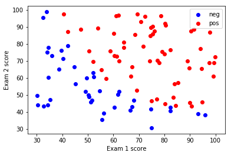
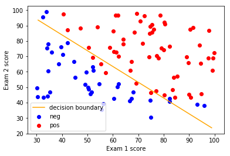
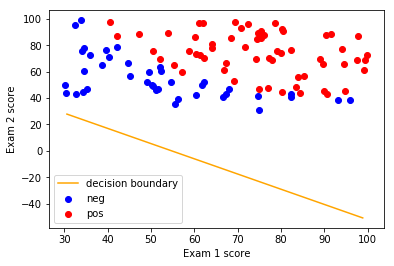
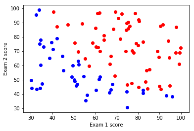

**Machine learning logistic regression assignment: MATLAB to Python**

As an exercise for calculating logistic regression for another project, I went back to the Machine Learning lecture on this topic and translated the assignment from MATLAB to Python. Others had done something similar to (or more than) what I've done here. Check out those Python implementations I found ([here](http://aimotion.blogspot.com/2011/11/machine-learning-with-python-logistic.html), [here](http://nbviewer.jupyter.org/github/tfolkman/learningwithdata/blob/master/Logistic%20Gradient%20Descent.ipynb), and [here](http://www.johnwittenauer.net/machine-learning-exercises-in-python-part-3/)). 

In some cases, I show the MATLAB code in an adjacent line as reference, but not always. Doing this exercise in Python and being able to check answers against the ML assignment gave me a better understanding of this function.


```python
# Import packages
import os
import pandas as pd
import numpy as np
import scipy as sp
import matplotlib.pyplot as plt
import seaborn as sns
%matplotlib inline
```


```python
os.chdir('/Users/lacar/Documents/Data Science/MachineLearning_Python/')
```

## Load data
The first two columns contains the exam scores and the third column
contains the label.


```python
data = pd.read_table('ex2data1.txt', sep=',', names=([0,1,2]))
X = data.iloc[:, [0, 1]]
y = data.iloc[:, 2];
```

## Plotting
We start the exercise by first plotting the data to understand the 
the problem we are working with. Blue is the negative class, red
is the positive class.


```python
# Plotting syntax is quite different from MATLAB.

f, (ax1) = plt.subplots(1,1);
mask = y==0;
ax1.scatter(x=X.loc[mask,0], y=X.loc[mask,1], color='blue', label='neg');
mask = y==1;
ax1.scatter(x=X.loc[mask,0], y=X.loc[mask,1], color='red', label='pos');
ax1.set_xlabel('Exam 1 score');
ax1.set_ylabel('Exam 2 score');
ax1.legend();
```





## Compute Cost and Gradient

These were the directions in the MATLAB code:
"In this part of the exercise, you will implement the cost and gradient
for logistic regression. You neeed to complete the code in costFunction.m."

I'll make each function a separate Jupyter cell.


```python
# Sigmoid function
def sigmoid(z):
    return (1 / (1 + np.exp(-z)))
```


```python
# Cost function
def costFunction(theta, X, y):
    # Initialize some useful values
    m = len(y);
    J = 0;
    grad = np.zeros(theta.shape)
    
    # -- code exercise from class (MATLAB code commented out)--- 
    # h = sigmoid(X*theta);
    h = sigmoid(np.dot(X, theta)).flatten()  # flatten needed from testing
    # J = 1/m*((-y'*log(h))-(1-y)'*log(1-h)); 
    step1 = np.dot(y.T, np.log(h))
    step2 = np.dot((1-y).T, np.log(1-h))
    J = (1/m)*(-step1-step2);
    # grad = 1/m*(X'*(h-y));
    grad = (1/m)*(np.dot(X.T,(h-y)));
    return (J, grad)
```


```python
# Setup the data matrix appropriately, and add ones for the intercept term
# [m, n] = size(X);
(m, n) = X.shape;

# Add intercept term to x and X_test
# X = [ones(m, 1) X];
X.insert(loc=0, column='x0', value=np.ones((m, 1)))

# Initialize fitting parameters
# initial_theta = zeros(n + 1, 1);
initial_theta = np.zeros((n + 1, 1));
```


```python
# Fingers crossed!

# Compute and display initial cost and gradient
# [cost, grad] = costFunction(initial_theta, X, y);
(cost, grad) = costFunction(initial_theta, X, y);
print('Cost at initial theta (zeros): ', cost);
print('Expected cost (approx): 0.693');
print('Gradient at test theta: \n', grad);
print('Expected gradients (approx): -0.1000 -12.0092 -11.2628')
```

    Cost at initial theta (zeros):  0.69314718056
    Expected cost (approx): 0.693
    Gradient at test theta: 
     [ -0.1        -12.00921659 -11.26284221]
    Expected gradients (approx): -0.1000 -12.0092 -11.2628


Looks good!


```python
# Another sanity check
# Compute and display cost and gradient with non-zero theta
test_theta = np.array([-24, 0.2, 0.2])
(cost, grad) = costFunction(test_theta, X, y);
print('Cost at test theta: ', cost);
print('Expected cost (approx): 0.218\n');
print('Gradient at test theta: ', grad);
print('Expected gradients (approx): 0.043, 2.566, 2.647');
```

    Cost at test theta:  0.218330193827
    Expected cost (approx): 0.218
    
    Gradient at test theta:  [ 0.04290299  2.56623412  2.64679737]
    Expected gradients (approx): 0.043, 2.566, 2.647


This looks good too! Onward.

## Optimizing using fmin_tnc for Python (fminunc in MATLAB)

Course directions say: "In this exercise, you will use a built-in function (fminunc) to find the optimal parameters theta."

Here's where things got tricky for me. I initially wasn't sure what optimization function to use. I was both informed and confused by what I found online, partly because sometimes cost and gradient were calculated in separate functions. In the MATLAB course, the cost and gradient were returned in the same function (```costFunction```) so I did the same. This is what course notes said about using ```fminunc```:

*"In this code snippet, we first defined the options to be used with fminunc. Specifically, we set the GradObj option to on, which tells ```fminunc``` that our function returns both the cost and the gradient. This allows fminunc to use the gradient when minimizing the function."*

The Python minimizatioon function I settled on using was [```fmin_tnc```](https://docs.scipy.org/doc/scipy-0.14.0/reference/generated/scipy.optimize.fmin_tnc.html) which I chose from looking at [this post](http://www.johnwittenauer.net/machine-learning-exercises-in-python-part-3/). In that example, the author had gradient as a separate function. From looking at the documentation, it looks like ```fmin_tnc``` can handle the optimized function either with or without the gradient being returned. If it's not returned, one has to specify the gradient function in the ```fprime``` parameter of ```fmin_tnc```.


```python
import scipy.optimize as opt  
```


```python
# The x0 parameter is the initial guess so I will set that to inital_theta.
result = opt.fmin_tnc(func=costFunction, x0=initial_theta, args=(X, y))
```

Returns of the fmin_tnc function are:
- the solution (the thetas): result[0]
- the number of function evaluations: result[1]
- return code as defined in the RCSTRINGS dict.: result[2]


```python
print('Thetas found by fmin_tnc function: ', result[0]);
print('Expected theta (approx): -25.161, 0.206, 0.201')
```

    Thetas found by fmin_tnc function:  [-25.16131869   0.20623159   0.20147149]
    Expected theta (approx): -25.161, 0.206, 0.201


```python
optimal_theta = result[0]
(cost, grad) = costFunction(optimal_theta, X, y)

print('Cost at theta found by scipy fmin_tnc: ', cost);
print('Expected cost with MATLAB fminunc (approx): 0.203\n');
```

    Cost at theta found by scipy fmin_tnc:  0.203497701589
    Expected cost with MATLAB fminunc (approx): 0.203
    


Cool, it worked! Now let's plot the decision boundary.

## Plotting the decision boundary

In the course, the MATLAB function was given to us as ```plotDecisionBoundary.m```. Initially, my strategy was going to do a nearly line-for-line translation of the MATLAB code to Python syntax, but since the plotting is quite different, I just ended up testing code and coming up with my own function.

### Determine the decision boundary linear equation.

From the lectures:
$ h_{\theta}(x) = g(\theta^Tx) \geq 0.5$ when $\theta^Tx \geq 0$.

In the case of two features:

$ h_{\theta}(x) = g(\theta_{0} + \theta_{1}x_{1} + \theta_{2}x_{2})$

Therefore: $\theta_{0} + \theta_{1}x_{1} + \theta_{2}x_{2} \geq 0$

We can re-arrange to solve for the linear equation: $ x_{2} = \frac{-\theta_{1}x_{1} - \theta_{0}}{\theta_{2}}\ $


```python
# Calculations for the decision boundary line equation.
slope = -optimal_theta[1]/optimal_theta[2]
yint = -optimal_theta[0]/optimal_theta[2]
print('slope: ', slope)
print('y-intercept: ', yint)
```

    slope:  -1.02362668061
    y-intercept:  124.887740234


The equation of the line is therefore:
$ x_{2} = -1.023x_{1} + 124.89 $

Looking at the plot of data above, this seems like a reasonable equation for the decision boundary.

### Standalone ```plotDecisionBoundary``` function


```python
def plotDecisionBoundary(theta, X, y):
    
    # Plot data
    f, (ax1) = plt.subplots(1,1);
    mask = y==0;
    ax1.scatter(x=X.loc[mask,0], y=X.loc[mask,1], color='blue', label='neg');
    mask = y==1;
    ax1.scatter(x=X.loc[mask,0], y=X.loc[mask,1], color='red', label='pos');
    ax1.set_xlabel('Exam 1 score');
    ax1.set_ylabel('Exam 2 score');

    # Calculations for the decision boundary line equation
    slope = -theta[1]/theta[2]
    yint = -theta[0]/theta[2]

    # Plot the decision boundary
    f_line = lambda x: slope*x + yint;

    # Use the min and max of x values
    x = np.array([min(X.loc[:,1]),max(X.loc[:,1])]);
    ax1.plot(x,f_line(x), c="orange", label="decision boundary");
    ax1.legend();
```


```python
plotDecisionBoundary(optimal_theta, X, y)
```





## Prediction and Accuracies
Course directions: "After learning the parameters, you'll like to use it to predict the outcomes on unseen data. In this part, you will use the logistic regression model to predict the probability that a student with score 45 on exam 1 and score 85 on exam 2 will be admitted.

Your task is to complete the code in predict.m."


```python
# Prediction function
def predict(theta, X):
    h = sigmoid(np.dot(X, theta)).flatten()
    p = h >= 0.5
    return p
```

Course directions: "Predict probability for a student with score 45 on exam 1 and score 85 on exam 2."


```python
prob = sigmoid(np.dot(np.array([1, 45, 85]), optimal_theta))
print('For a student with scores 45 and 85, we predict an admission probability of: ', prob);
print('Expected value: 0.775 +/- 0.002');
```

    For a student with scores 45 and 85, we predict an admission probability of:  0.77629062427
    Expected value: 0.775 +/- 0.002


```python
# Compute accuracy on our training set
p = predict(optimal_theta, X);
```


```python
print('Train Accuracy: ', np.mean(p == y) * 100);
print('Expected accuracy (approx): 89.0');
```

    Train Accuracy:  89.0
    Expected accuracy (approx): 89.0


## Conclusion


However, one thing I did differently from the above examples was looking at what scikit-learn's logistic regression model is returning and comparing what's calculated in this assginment.


## Return values from scikit-learn's logistic regression function 

This is a digression from the Machine Learning assignment but I wanted to see what thetas are returned in [scikit-learn's function](http://scikit-learn.org/stable/modules/generated/sklearn.linear_model.LogisticRegression.html).


```python
from sklearn.linear_model import LogisticRegression

# Instantiate a logistic regression model, and fit with X and y 
model = LogisticRegression()
model = model.fit(X, y)
```


```python
sk_lr_coef = model.coef_[0]
```


```python
print('class-derived optimal theta: ', optimal_theta)
print('scikit-learn coefficients: ', sk_lr_coef)
```

    class-derived optimal theta:  [-25.16131869   0.20623159   0.20147149]
    scikit-learn coefficients:  [-2.85831439  0.05214733  0.04531467]


Those values obviously look different. Maybe the SKL function doesn't need an initialization of 1's as the first feature? Let's try that.


```python
model.intercept_
```


    array([-2.85831439])


```python
X_prime = X.loc[:,[0,1]]
model = model.fit(X_prime, y)
print(model.coef_[0])
```

    [ 0.03844482  0.03101855]


Nope. Let's assume the first SKL coefficient's were "right" and plot the decision boundary to maybe see what's going on.


```python
plotDecisionBoundary(sk_lr_coef, X, y)
```





Uhhh... yeah, that doesn't look right.

Googled around and found this:

https://www.kunxi.org/notes/machine_learning/logistic_regression/

https://stackoverflow.com/questions/18993867/scikit-learn-logistic-regression-model-coefficients-clarification


```python
from sklearn.multiclass import OneVsRestClassifier
from sklearn.linear_model import LogisticRegression
```


```python
classifier = OneVsRestClassifier(LogisticRegression(penalty='l1')).fit(X, y)
print('Coefficents: ', classifier.coef_)
print('Intercept" ', classifier.intercept_)
```

    Coefficents:  [[-5.78353169  0.09915556  0.09304624]]
    Intercept"  [[-5.95047461]]


```python
coef = classifier.coef_
intercept = classifier.intercept_

# see the coutour approach for a more general solution
ex1 = np.linspace(30, 100, 100)
ex2 = -(coef[:, 0] * ex1 + intercept[:, 0]) / coef[:,1]
```


```python
plt.plot(ex1, ex2, color='r', label='decision boundary');
```


```python
coef
```


    array([-6.46010859,  0.09915856,  0.09304537])


```python
-(coef[:, 0] * ex1 + intercept[:, 0]) / coef[:,1]
```


```python
coef * ex1 #+ intercept[0]
```


    ---------------------------------------------------------------------------

    ValueError                                Traceback (most recent call last)

    <ipython-input-251-67d7e188b698> in <module>()
    ----> 1 coef * ex1 #+ intercept[0]
    

    ValueError: operands could not be broadcast together with shapes (3,) (100,) 


```python
plotDecisionBoundary(coef, X, y)
```


    ---------------------------------------------------------------------------

    IndexError                                Traceback (most recent call last)

    <ipython-input-259-92e182506e57> in <module>()
    ----> 1 plotDecisionBoundary(coef, X, y)
    

    <ipython-input-171-181871d9f5c4> in plotDecisionBoundary(theta, X, y)
         11 
         12     # Calculations for the decision boundary line equation
    ---> 13     slope = -theta[1]/theta[2]
         14     yint = -theta[0]/theta[2]
         15 


    IndexError: index 1 is out of bounds for axis 0 with size 1




